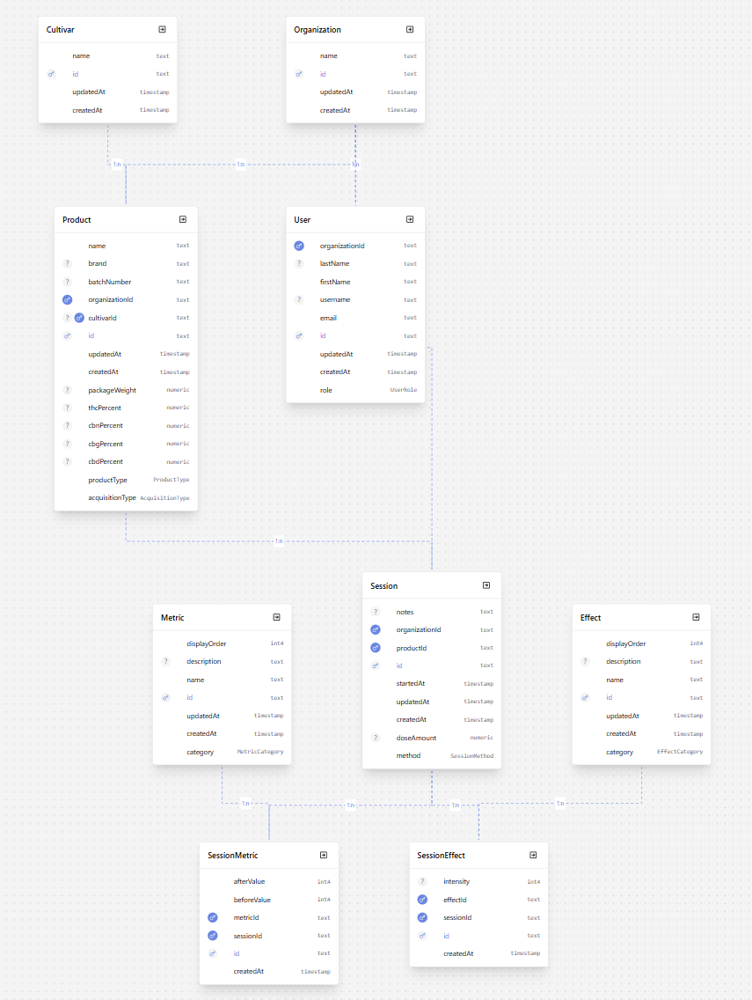
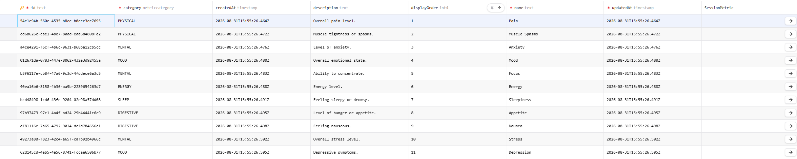
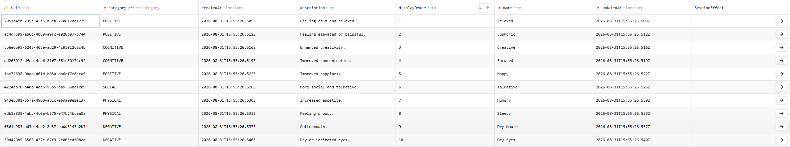

# ReliefRoot

> **Track the plant. Track the profile. Track the relief.**

ReliefRoot is an open-source full-stack application designed to help users
understand how different cannabis cultivars, cannabinoid profiles, terpene
profiles, growing methods, and consumption methods relate to their personal
experiences.

Whether cannabis is purchased or home-grown, ReliefRoot provides a structured
way to collect data, identify patterns, and make informed decisions based on
real usage history.

---

## Mission

ReliefRoot exists to answer one question:

> **"What works best for me, and why?"**

Rather than relying on anecdotal recommendations, ReliefRoot aims to organize
cultivation, laboratory, and session data into meaningful insights that users
can explore over time.

---

## Vision

ReliefRoot is being developed as a personal analytics platform capable of
tracking the complete lifecycle of cannabis use, from cultivation to
consumption.

Long-term goals include:

- Cultivation tracking
- Cultivar database
- Breeder information
- Cannabinoid profiles
- Terpene profiles
- COA (Certificate of Analysis) data
- Session tracking
- Personal effect tracking
- Community analytics
- Data-driven recommendations
- Trend visualization
- Grow journals

---

## Current Development Status

**Project Phase:** Sprint 1 — Backend Database & API Foundation

The current development focus is the backend database foundation and
analytics-ready session tracking.

### Completed

- Professional monorepo and repository structure
- Development standards and documentation architecture
- Git workflow and GitHub Actions CI
- Dockerized PostgreSQL development database
- Prisma 7 configuration and migration workflow
- Organization-centered relational data model
- Global cultivar reference model
- Product and consumption session tracking
- Metric and effect analytics models
- Metric and effect categorization
- Prisma seed workflow
- Default Metric and Effect reference data
- Reusable Prisma Client for the API
- Express routing and global error handling

### Current Focus

- Connect the Express API to Prisma
- Implement read-only Metric and Effect endpoints
- Implement core CRUD endpoints
- Exercise the complete data model through Postman

---

## Architecture

ReliefRoot currently uses an organization-centered relational data model
backed by PostgreSQL and Prisma.

<!-- Screenshot:
docs/screenshots/database/prisma-schema-overview.png
-->



### Seeded Metrics

- The default metric reference data provides standardized measurements for comparing session outcomes across physical, mental, mood, sleep, energy, and digestive categories.



### Seeded Effects

- The default effect reference data captures common positive, cognitive, social, physical, and negative outcomes reported during a session.



### Current Database Flow

```text
Organization
├── User
├── Product
│   └── Cultivar
└── Session
    ├── SessionMetric
    │   └── Metric
    └── SessionEffect
        └── Effect
```

### Current File Structure

```text
ReliefRoot/
├── .github/
├── .husky/
├── .idea/
│
├── apps/
│   ├── api/
│   │   ├── dist/
│   │   ├── src/
│   │   │   ├── config/
│   │   │   ├── controllers/
│   │   │   ├── generated/
│   │   │   │   └── prisma/
│   │   │   ├── lib/
│   │   │   ├── middleware/
│   │   │   ├── models/
│   │   │   ├── routes/
│   │   │   ├── services/
│   │   │   ├── types/
│   │   │   ├── utils/
│   │   │   ├── app.ts
│   │   │   └── index.ts
│   │   ├── tests/
│   │   ├── package.json
│   │   └── tsconfig.api.json
│   │
│   └── web/
│       └── index.ts
│
├── database/
│   ├── prisma/
│   │   ├── migrations/
│   │   ├── schema.prisma
│   │   └── seed.ts
│   ├── seeds/
│   ├── sql/
│   └── README.md
│
├── docker/
├── docs/
├── packages/
├── scripts/
│
├── .editorconfig
├── .env.example
├── .gitignore
├── .prettierignore
├── .prettierrc
├── eslint.config.mjs
├── package.json
├── prisma.config.ts
├── README.md
└── tsconfig.base.json
```
